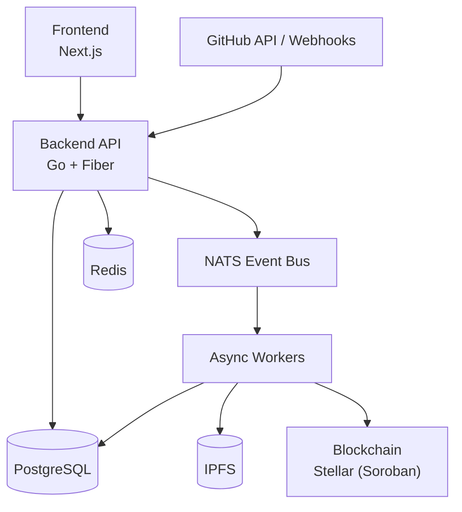
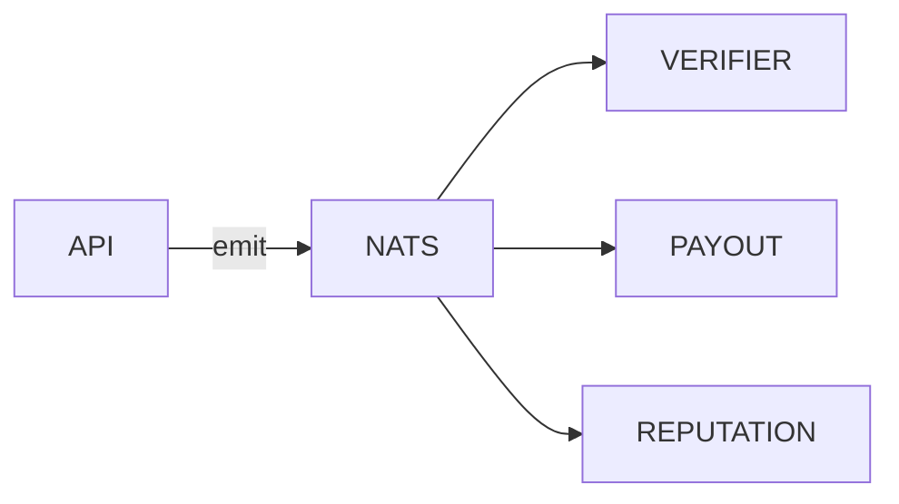
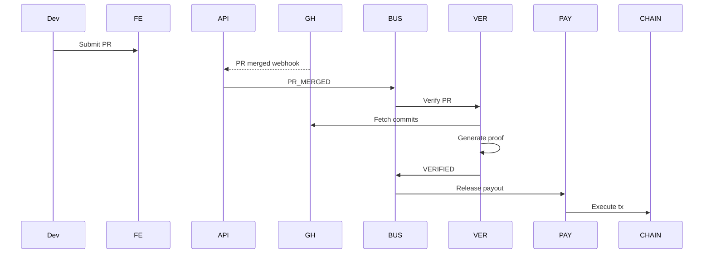
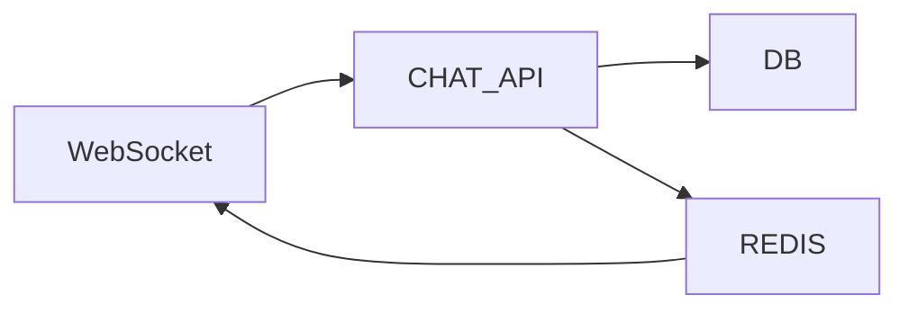

# 📘 Patchwork — Full System Architecture (Frontend, Backend, Smart Contracts)

This document explains **Patchwork** at a **very low level**, covering:

- Frontend architecture
- Backend architecture
- Async systems
- Chat system
- Smart contracts (Stellar / Soroban)
- Data flow
- Security & trust model

This is meant for **engineering alignment**, not marketing.

---

## 1. What is Patchwork (System View)

**Patchwork** is a multi-ecosystem infrastructure that:

- connects open-source developers with open-source projects
- tracks verifiable contributions (PRs, issues, commits)
- locks rewards on-chain
- automatically pays contributors on successful merges
- builds reputation and rankings
- enables direct dev ↔ maintainer communication

Patchwork is **not a chain**.

Patchwork is a **coordination + verification layer**.

---

## 2. High-Level Architecture Overview



## 3. Frontend Architecture (Very Low Level)

### 3.1 Tech Stack

- Next.js (App Router)
- TypeScript
- Tailwind CSS
- Wallet SDKs (Stellar)
- WebSockets (chat)
- REST + SSE

### 3.2 Frontend Responsibilities

The frontend is thin.

All trust logic lives in the backend.

Frontend handles:

- wallet connection
- GitHub OAuth flow
- data visualization
- chat UI
- transaction signing
- user interactions

### 3.3 Frontend Modules

```text
/app
 ├── auth
 ├── dashboard
 ├── projects
 ├── bounties
 ├── submissions
 ├── patchquest
 ├── leaderboard
 ├── chat
 └── admin
```

### 3.4 Wallet Flow (Frontend)

- User connects wallet
- Signs nonce
- Sends signature to backend
- Receives JWT
- All requests authenticated via JWT

### 3.5 Chat (Frontend)

- WebSocket connection
- Room-based subscriptions
- Optimistic UI updates
- Messages persisted only after backend ACK

## 4. Backend Architecture (Very Low Level)

### 4.1 Tech Stack

| Layer | Technology |
| --- | --- |
| Language | Go 1.22+ |
| HTTP | Fiber (fasthttp) |
| DB | PostgreSQL |
| DB Driver | pgx |
| Cache | Redis |
| Event Bus | NATS |
| Storage | IPFS |
| Auth | Wallet + GitHub OAuth |

### 4.2 Backend Philosophy

- HTTP APIs must be fast and predictable
- No external calls in request path
- All heavy work is async
- Database is source of truth
- Blockchain is settlement layer

### 4.3 Backend Services

```text
api-gateway
 ├── auth
 ├── projects
 ├── bounties
 ├── submissions
 ├── chat
 ├── reputation
 ├── leaderboard
 └── admin

workers
 ├── github-sync
 ├── verifier
 ├── payout
 ├── reputation
 └── notifications
```

### 4.4 Database (PostgreSQL)

Postgres stores truthful state only.

Core tables:

- users
- projects
- bounties
- submissions
- payouts
- reputation_events
- chat_rooms
- chat_messages

### 4.5 Redis (Coordination Layer)

Redis is used for:

- rate limiting
- webhook deduplication
- leaderboards (sorted sets)
- hot reads (project pages)
- chat pub/sub

Redis is never the source of truth.

### 4.6 Event-Driven Backend



API only emits events.

Workers process events independently.

## 5. GitHub Integration (Critical)

### 5.1 GitHub Webhooks

Subscribed events:

- issues
- pull_request
- pull_request_review
- push

### 5.2 Webhook Handling Rules

- Validate signature
- Deduplicate via Redis
- Emit event to NATS
- Return 200 OK
- Never process GitHub logic inline

## 6. Contribution Flow (End-to-End)



## 7. Smart Contracts (On-Chain Layer)

### 7.1 Design Principle

Smart contracts are:

- minimal
- deterministic
- dumb by design

All logic stays off-chain.

### 7.2 Stellar (Soroban) Smart Contracts

Escrow Contract

Responsibilities:

- lock funds
- release funds to contributor
- allow refunds on timeout

Data:

- project_id
- bounty_id
- contributor_address
- amount

### 7.3 Stellar Transaction Execution

Used for:

- escrow releases
- automated settlement

Flow:

- backend emits payout intent
- Soroban transaction executes
- tx confirmation sent back

## 8. Verification System

Verification includes:

- PR merge check
- commit author check
- issue mapping
- optional test execution

Proof format:

- JSON
- hashed
- stored on IPFS

## 9. Reputation System

Reputation is:

- calculated off-chain
- optionally anchored on-chain
- immutable history

Factors:

- bounty value
- project reputation
- PatchQuest weight

## 10. PatchQuest (Monthly Hackathon Engine)

PatchQuest is:

- a time-boxed contribution window
- leaderboard snapshot
- reward pool allocator

Backend responsibilities:

- cycle start/end
- scoring
- ranking freeze
- payout triggers

## 11. Chat System (Dev ↔ Maintainer)

Purpose

- clarify requirements
- negotiate scope
- avoid PR rejection

Backend Chat Model



Features:

- wallet-authenticated messages
- project-scoped rooms
- bounty threads
- moderation flags

## 12. Security Model

- Wallet signature auth
- Webhook signature validation
- Idempotent workers
- Replay protection
- Role-based permissions
- Audit logs
- Optional KYC hooks (admin)

## 13. Why This Architecture Works

- Low latency APIs (1–5ms)
- Massive concurrency (goroutines)
- No RPC blocking
- Chain-agnostic
- Hackathon + production ready
- Trust minimized
- Future-proof

## 14. Future Extensions

- AI PR review
- AI contributor matching
- milestone-based grants
- DAO voting
- zk-proof verification
- cross-chain identity

## 15. Summary

Patchwork is:

- not a marketplace
- not a DAO
- not a chain

Patchwork is:

an open-source contribution coordination layer with verifiable payouts.


